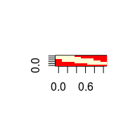

<!-- README.md is generated from README.Rmd. Please edit that file -->
tableMatrix
===========

`tableMatrix` package provides structures to store data. First one is tableList which only serves to wrap data.table and additional structures together, second is tableMatrix that combines useful features of data.table and matrix to gain faster access to data.

Installation
------------

From github:

``` r
# install.packages("devtools")
devtools::install_github("InferenceTechnologies/tableMatrix")
```

Motivation
----------

### tableList

It is needed to wrap a data.table object and other structures together and preserve data.table behaviour.

#### Example

Dataset and linear model stored in tableList.

``` r
data(chickwts)
tl <- tableList(chickwts, lm(weight~feed, chickwts))

mean(tl[feed=="casein", weight])
#> [1] 323.5833

aid(tl)
#> 
#> Call:
#> lm(formula = weight ~ feed, data = chickwts)
#> 
#> Coefficients:
#>   (Intercept)  feedhorsebean    feedlinseed   feedmeatmeal    feedsoybean  
#>       323.583       -163.383       -104.833        -46.674        -77.155  
#> feedsunflower  
#>         5.333
```

### tableMatrix

Let's have dataset which consists of two parts - metadata columns (any types) and main data columns (only one type). If whole data were stored as data.table (data.frame), access to main part would be much slower (slow indexing in data.table). `tableMatrix` is result for this. It combines best of data.table (access via bracket to metadata part) and matrix. It stores dimensions of main part and effectively use this information while using multiple datasets which can have different dimensions of main data. It also can store additional structures.

#### Example

Solving simple task - recreating pictures from data with `tableMatrix`. Used datasets (images8By8, images15By15) are bitmaps. First let's see a sample image of a images8By8 dataset.

``` r
#loading data
data(images8By8)
?images8By8
#> Using development documentation for images8By8
data(images15By15)

#creating tableMatrix from both datasets
#first 3 cols used as metadata, rest as main data, dimensions of images
tm <- tableMatrix(list(images15By15, images8By8),
list(1:3, 1:3), list(c(4:ncol(images15By15)),c(4:ncol(images8By8))), list(c(15,15), c(8,8)))

#number of matrices stored in mat part
length(mat(tm))
#> [1] 2

#dimensions of main data
#2 matrices in mat part -> 2 rows in matDim
matDim(tm)
#>    tm.matN dim1 dim2
#> 1:       1   15   15
#> 2:       2    8    8


#additional structures - now empty
aid(tm)
#> list()

#metadata
#tm.matN and tm.matRow are data.table keys 
#tm.matN is index of a matrix in mat part
tab(tm)
#>      tm.matN tm.matRow direction dimX dimY
#>   1:       1         1      down   15   15
#>   2:       1         2      down   15   15
#>   3:       1         3      down   15   15
#>   4:       1         4      down   15   15
#>   5:       1         5      down   15   15
#>  ---                                      
#> 176:       2        86      both    8    8
#> 177:       2        87      both    8    8
#> 178:       2        88      both    8    8
#> 179:       2        89      both    8    8
#> 180:       2        90      both    8    8

#image data from first row of 2nd matrix in mat part
image <- getRow(tm,repo=c(2,1))

#restoring dimension of this image
dim(image) <- getRowDim(tm,repo=c(2,1))

#visualising image
image(image)
```



Now we'll recreate heat map.

``` r
#subsetting via bracket passed to metadata part
#selecting via tm.matN and direction
tabSub <- tm[.(2)][direction=="down"]

#only 1 matrix is in mat
matDim(tabSub)
#>    tm.matN dim1 dim2
#> 1:       1    8    8

#confirmation
length(mat(tabSub))
#> [1] 1


#recreating heat map from mean of samples
imageMean <- colMeans(mat(tabSub,1))

#restoring original dimensions
dim(imageMean) <- getRowDim(tabSub,1)

#visualising image
image(imageMean)
```


