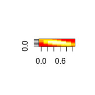
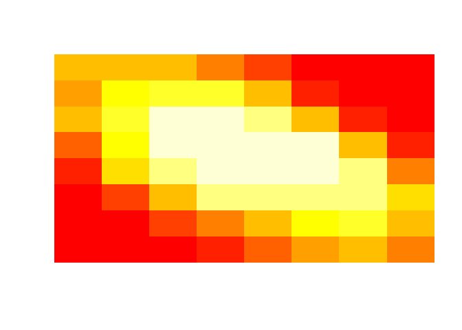

<!-- README.md is generated from README.Rmd. Please edit that file -->
tableMatrix package
===================

tableMatrix package provides two advanced data structures built on top of data.table. Simple `tableList` object wraps data.table and any additional data together. More complex `tableMatrix` object combines strengths of data.table and matrix.

Installation
------------

From CRAN:

``` r
install.packages("tableMatrix")
```

From github:

``` r
# install.packages("devtools")
devtools::install_github("InferenceTechnologies/tableMatrix")
```

tableList object
----------------

### Motivation

Goal is to wrap a data.table object and other structures together and preserve data.table behaviour.

### Example

Combine data and linear model into one object.

``` r
data(chickwts)
 
# Bundle chickwts data.frame together with a linear model
TL <- tableList(chickwts, lm(weight~feed, chickwts))

# tableList behaves like a data.table  
mean(TL[feed=="casein", weight])
#> [1] 323.5833

# Aid part of the tableList object carries the linear model
aid(TL)
#> 
#> Call:
#> lm(formula = weight ~ feed, data = chickwts)
#> 
#> Coefficients:
#>   (Intercept)  feedhorsebean    feedlinseed   feedmeatmeal    feedsoybean  
#>       323.583       -163.383       -104.833        -46.674        -77.155  
#> feedsunflower  
#>         5.333
```

tableMatrix object
------------------

### Motivation

Let's have a dataset with the following structure: first set of columns of varying types is intented as meta data, second set of columns of the same type is intended as main data. `tableMatrix` stores meta data as a data.table and main data as a matrix. It also keeps track of dimensions of main data, thus allowing to combine rows of varying lengths into one object. As in tableList, tableMatrix can carry any additional aid data.

### Example

Working with bitmaps of different sizes. Datasets `images8By8` and `images10By10` contain 8x8 and 10x10 images in the form of vectors. For each row first three columns represent image meta data, remaining columns represent the image itself. For more information see `?images8By8`.

``` r
# Load datasets
data(images8By8)
data(images10By10)

# Create a signle tableMatrix object from both datasets
# First 3 columns used as meta data, the rest as main data with corresponding dimensions
TM <- tableMatrix(list(images8By8, images10By10),
list(1:3, 1:3), list(c(4:ncol(images8By8)),c(4:ncol(images10By10))), list(c(8,8), c(10,10)))

# Default print displays the table (meta data) part
TM
#>      direction dimX dimY
#>   1:      down    8    8
#>   2:      down    8    8
#>   3:      down    8    8
#>   4:      down    8    8
#>   5:      down    8    8
#>  ---                    
#> 176:      both   10   10
#> 177:      both   10   10
#> 178:      both   10   10
#> 179:      both   10   10
#> 180:      both   10   10

# Number of matrices stored in the matrix (main data) part
length(mat(TM))
#> [1] 2

# Dimensions of the matrix part
matDim(TM)
#>    tm.matN tm.matDim1 tm.matDim2
#> 1:       1          8          8
#> 2:       2         10         10

# Aid part is empty
aid(TM)
#> list()


# Image data for first row
img <- getRow(TM, 1)

# Restoring dimensions of the image
dim(img) <- getRowDim(TM, 1)

# Visualising the image
image(img, axes=F)
```



Let's create a heat map

``` r
# Subsetting via bracket passed to the table (meta data) part
# We choose first matrix type, down direction
TM1down <- TM[.(1)][direction=="down"]

# One matrix in the matrix part of TM1down
length(mat(TM1down))
#> [1] 1

# One dimension row
matDim(TM1down)
#>    tm.matN tm.matDim1 tm.matDim2
#> 1:       1          8          8

# Heatmap
imgHeat <- colMeans(mat(TM1down, 1))

# Restoring dimensions of the heatmap
dim(imgHeat) <- getRowDim(TM1down, 1)

# Visualising heatmap
image(imgHeat, axes=F)
```


