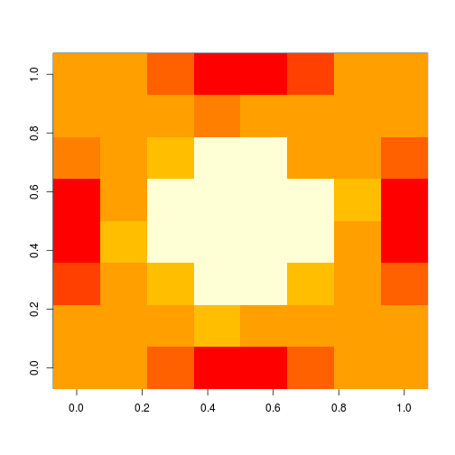

#tableMatrix

`tableMatrix` package provides structure to store data. It is mainly useful for datasets which have following condition: some columns describe data and main data could be stored as matrix. `tableMatrix` purpose is to get faster access.

##Installation
From github:

```r
# install.packages("devtools")
devtools::install_github("InferenceTechnologies/tableMatrix")
```

##Examples

Creation of `tableMatrix` with 2 datasets.


```r
data(images8By8)
colnames(images8By8)
#>  [1] "direction" "dimX"      "dimY"      "pixel1"    "pixel2"   
#>  [6] "pixel3"    "pixel4"    "pixel5"    "pixel6"    "pixel7"   
#> [11] "pixel8"    "pixel9"    "pixel10"   "pixel11"   "pixel12"  
#> [16] "pixel13"   "pixel14"   "pixel15"   "pixel16"   "pixel17"  
#> [21] "pixel18"   "pixel19"   "pixel20"   "pixel21"   "pixel22"  
#> [26] "pixel23"   "pixel24"   "pixel25"   "pixel26"   "pixel27"  
#> [31] "pixel28"   "pixel29"   "pixel30"   "pixel31"   "pixel32"  
#> [36] "pixel33"   "pixel34"   "pixel35"   "pixel36"   "pixel37"  
#> [41] "pixel38"   "pixel39"   "pixel40"   "pixel41"   "pixel42"  
#> [46] "pixel43"   "pixel44"   "pixel45"   "pixel46"   "pixel47"  
#> [51] "pixel48"   "pixel49"   "pixel50"   "pixel51"   "pixel52"  
#> [56] "pixel53"   "pixel54"   "pixel55"   "pixel56"   "pixel57"  
#> [61] "pixel58"   "pixel59"   "pixel60"   "pixel61"   "pixel62"  
#> [66] "pixel63"   "pixel64"
dim(images8By8)
#> [1] 90 67
data(images15By15)
dim(images15By15)
#> [1]  90 228

tm <- tableMatrix(list(images15By15, images8By8),
list(1:3, 1:3), list(c(4:ncol(images15By15)),c(4:ncol(images8By8))), list(c(15,15), c(8,8)))

tm$tab
#>      tm.matN tm.matRow direction dimX dimY
#>   1:       1         1      down   15   15
#>   2:       1         2      down   15   15
#>   3:       1         3      down   15   15
#>   4:       1         4      down   15   15
#>   5:       1         5      down   15   15
#>  ---                                      
#> 176:       2        86      both    8    8
#> 177:       2        87      both    8    8
#> 178:       2        88      both    8    8
#> 179:       2        89      both    8    8
#> 180:       2        90      both    8    8

tm$matDim
#>    tm.matN dim1 dim2
#> 1:       1   15   15
#> 2:       2    8    8

#get data from second matrix where direction is "both"
tabSub <- tm[.(2)][direction=="both"]

imageMean <- colMeans(mat(tabSub,1))
dim(imageMean) <- getRowDim(tabSub,1)

image(imageMean)
```


